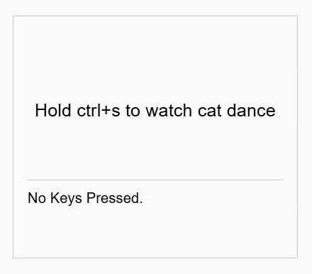
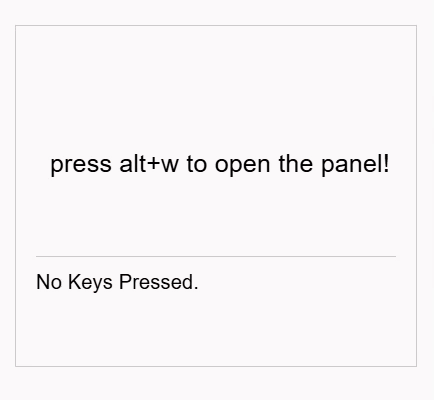
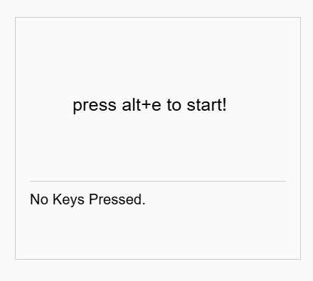

# Mouseless

`mouseless` is a React library that helps to define high-level keyboard operations.

## Installation

Install from npm:
```
npm install @ftyyy/mouseless
```

## Feature Highlights

Code below are simplified. See [example/](/example/) for full examples.

<table style="border: none !important; border-collapse: collapse !important; border-spacing: 0 !important; padding: 0 !important; margin: 0 !important;">
<tr style="border: none !important;">

<td style="border: none !important; padding: 0 !important;" width="50%">

**Keep Tracking of Pressed and Holding Keys**

Also notice how default behavior of the browser is prevented.

```javascript
function MyComponent(){
    const holding = useKeyHoldingState(["Ctrl", "s"])

    return holding && <CatDance />
}
```

</td>
<td style="border: none !important; padding: 0 !important;" width="50%">



</td>
</tr>

<tr style="border: none !important;">
<td style="border: none !important; padding: 0 !important;" width="50%">

**Use Keyboard to Navigate UI Elements**

```javascript
function MyComponent({onClick}){
    const keys = ["Alt", "w"]
    const holding = useKeyHoldingState(keys)
    const [space, node] = useSpaceNavigatorState()
    const [ 
        add_handler, del_handler
    ] = useKeyEventsHandlerRegister()

    React.useEffect(()=>{
        const handler = ()=>(
            (space == "my_space") && onClick(node)
        )
        add_handler(keys, "Enter", false, handler)
        return ()=>{
            del_handler(keys, "Enter", false, handler)
        }
    }, [space , node])

    return (holding && (space == "my_space")) && (
        <Penel cur_node={node}>
    )
}
```

</td>
<td style="border: none !important; padding: 0 !important;" width="50%">



</td>
</tr>

<tr style="border: none !important;">
<td style="border: none !important; padding: 0 !important;" width="50%">

**Use Keyboard to Move UI Elements**

```javascript
function MyComponent(){
    const keys = ["Alt", "r"]
    const holding = useKeyHoldingState(keys)
    const L = useKeyHoldingState([...keys, "ArrowLeft"])
    const R = useKeyHoldingState([...keys, "ArrowRight"])
    const U = useKeyHoldingState([...keys, "ArrowUp"])
    const D = useKeyHoldingState([...keys, "ArrowDown"])
    const [pos, set_pos] = React.useState({x: 0, y: 0})

    React.useEffect(()=>{
        const interval = setInterval(() => {
            let dx = (R ? 4 : 0) - (L ? 4 : 0)
            let dy = (D ? 4 : 0) - (U ? 4 : 0)
            set_pos({x: pos.x + dx, y: pos.y + dy})
        }, 10)
        return ()=>{clearInterval(interval)}
    }, [pos, L, R, U, D])

    return holding && <Plane x={pos.x} y={pos.y} />
}
```

</td>
<td style="border: none !important; padding: 0 !important;" width="50%">



</td>

</tr>

</table>

## Quick Start

TODO
